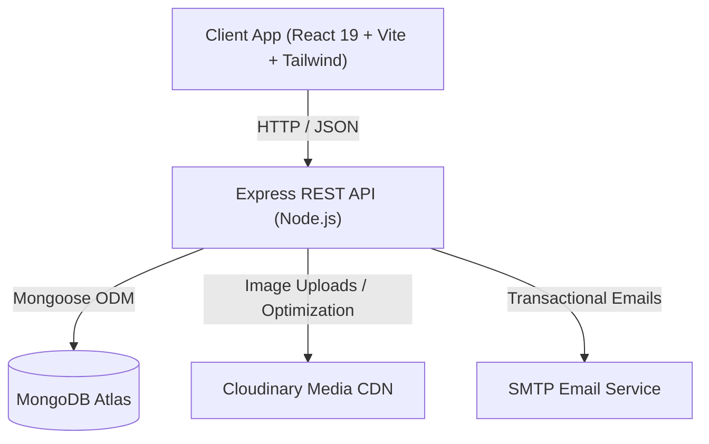

<div align="center">

# ✨ MetaTrybe — Full-Stack Agency & Developer Portfolio

An immersive, high-performance creative agency and developer portfolio web application built with **React 19**, **Three.js**, **GSAP**, **Tailwind CSS**, and a robust **Node.js/Express + MongoDB** backend with an integrated CMS, lead scoring engine, and automated email workflows.

<br />

[](https://react.dev/)
[](https://vitejs.dev/)
[](https://tailwindcss.com/)
[](https://threejs.org/)
[](https://greensock.com/gsap/)
[](https://nodejs.org/)
[](https://expressjs.com/)
[](https://www.mongodb.com/)
[](https://cloudinary.com/)

</div>

---

## 📖 Table of Contents

- [Overview](#-overview)
- [Key Features](#-key-features)
- [Architecture & Tech Stack](#-architecture--tech-stack)
- [Project Structure](#-project-structure)
- [Getting Started](#-getting-started)
  - [Prerequisites](#prerequisites)
  - [1. Clone Repository](#1-clone-repository)
  - [2. Backend Setup](#2-backend-setup)
  - [3. Frontend Setup](#3-frontend-setup)
- [Environment Variables](#-environment-variables)
- [REST API Reference](#-rest-api-reference)
- [Production & Deployment](#-production--deployment)
- [Security & Privacy](#-security--privacy)
- [License](#-license)

---

## 🌟 Overview

This repository contains the complete full-stack codebase for a modern digital agency and portfolio web application. Designed with high-end visual aesthetics and buttery-smooth user interactions, it combines 3D canvas rendering, shader effects, and micro-interactions on the frontend with a scalable REST API on the backend.

### What's Inside:
- **Client App (`/my-app`)**: A dynamic Single Page Application (SPA) with smooth transitions, 3D WebGL scenes, interactive case study showcases, a live project previewer, and an administrative control panel.
- **Backend API (`/server`)**: An Express REST API with MongoDB persistence, JWT authentication, rate limiting, an intelligent lead scoring algorithm, transactional email triggers, and Cloudinary media optimization.

---

## 🚀 Key Features

### 🎨 Immersive Frontend Experience
- **Fluid Motion & Smooth Scroll**: Integrated **Lenis** smooth scrolling coupled with **GSAP ScrollTrigger** and **Framer Motion** page transitions.
- **3D & Creative Shaders**: Interactive WebGL components powered by **Three.js**, **@react-three/fiber**, and **OGL** (metallic paint effects, interactive particle cursor, tilted cards, and pixel hover animations).
- **Dynamic Case Studies**: Deep-dive project pages featuring problem statements, solutions, multi-row gallery grid displays (landscape/square layouts), role details, and live project demo links.
- **Interactive Sample Work Previewer**: Dedicated preview interface showcasing sample designs and responsive layouts.
- **Floating Chat Assistant**: Integrated assistant widget providing interactive site guidance.

### 💼 Portfolio Management CMS (`/admin`)
- **Complete Project CRUD**: Create, read, update, and delete showcase projects directly from the browser.
- **Direct Cloudinary Integration**: Drag-and-drop or paste image uploads directly to Cloudinary CDN with automatic thumbnail generation.
- **Configurable Gallery Rows**: Flexible layout management allowing mixed landscape and square image rows per project.
- **In-Memory Caching**: 60-second caching layer on public project endpoints with instant cache invalidation upon project edits.

### 📊 Lead Pipeline & CRM (`/admin/leads`)
- **Interactive Multi-Step Inquiry Modal**: Captures client details, target launch dates, industry focus, and budget ranges (including custom and recommended budget options).
- **Algorithmic Lead Scoring Engine**: Automatically scores incoming inquiries based on budget, company information, region, and message length to assign priority tiers (`High`, `Medium`, `Low`).
- **Pipeline Management Dashboard**: Filter, search, track conversion rates, and update lead statuses (`New`, `Contacted`, `In Progress`, `Converted`, `Archived`).
- **Transactional Email Workflows**: Automatic Nodemailer SMTP integration sending instant administrator notifications and branded auto-reply confirmations to clients.

---

## 🛠 Architecture & Tech Stack



### Frontend (`my-app`)
- **Core**: React 19, Vite 8, React Router v7
- **Styling**: Tailwind CSS v4, PostCSS, Custom Vanilla CSS Modules
- **Animation & 3D**: Three.js, `@react-three/fiber`, `@react-three/drei`, GSAP, Framer Motion, Anime.js, OGL, Lenis Scroll
- **UI Components & Icons**: Lucide React, Swiper, custom glassmorphic components

### Backend (`server`)
- **Runtime**: Node.js, Express 5
- **Database**: MongoDB Atlas with Mongoose ODM
- **Authentication**: JSON Web Tokens (JWT) & bcryptjs
- **Media & File Storage**: Cloudinary SDK & Sharp image processing
- **Email Delivery**: Nodemailer (SMTP)
- **Validation & Security**: Express Rate Limit, Express Validator, CORS, Proxy Trust

---

## 📁 Project Structure

```text
Portfolio/
├── my-app/                          # Frontend Application (React + Vite)
│   ├── public/                      # Static assets & icons
│   ├── src/
│   │   ├── assets/                  # Media files, videos & textures
│   │   ├── components/              # UI components, 3D canvases & widgets
│   │   │   ├── ChatBot/             # Interactive chat assistant
│   │   │   ├── homeComponents/      # Hero, Showcase, Skills & Services
│   │   │   └── ui/                  # Reusable atomic UI elements
│   │   ├── context/                 # React Contexts (Projects, Contact, Transition)
│   │   ├── data/                    # Fallback mock data & sample projects
│   │   ├── pages/                   # Application routes
│   │   │   ├── About/               # About page
│   │   │   ├── AdminDashboard.jsx   # Project CMS manager
│   │   │   ├── AdminLeads.jsx       # Leads CRM & analytics dashboard
│   │   │   ├── ContactUs.jsx        # Contact inquiry modal
│   │   │   ├── Home.jsx             # Landing page
│   │   │   ├── ProjectDetail.jsx    # Dynamic case study view
│   │   │   ├── SampleWork.jsx       # Sample work gallery
│   │   │   └── Work.jsx             # Projects catalogue
│   │   ├── utils/                   # Frontend helpers & API clients
│   │   ├── App.jsx                  # Main router & provider wrapper
│   │   ├── index.css                # Global design tokens & styling
│   │   └── main.jsx                 # React DOM entrypoint
│   ├── .env.example                 # Frontend environment template
│   ├── package.json
│   └── vite.config.js
│
├── server/                          # Backend API (Node.js + Express)
│   ├── middleware/
│   │   └── authMiddleware.js        # JWT verification middleware
│   ├── models/
│   │   ├── Lead.js                  # Lead CRM schema
│   │   └── Project.js               # Portfolio project schema
│   ├── routes/
│   │   ├── authRoutes.js            # Authentication endpoints
│   │   ├── leadRoutes.js            # Lead submission, stats & management
│   │   └── projectRoutes.js         # Project CRUD & image upload endpoints
│   ├── utils/
│   │   ├── cloudinary.js            # Cloudinary upload helpers
│   │   ├── emailService.js          # Nodemailer email templates & sender
│   │   └── leadScoring.js           # Automated lead priority scoring engine
│   ├── .env.example                 # Backend environment template
│   ├── package.json
│   └── server.js                    # Express application entrypoint
│
├── .gitignore                       # Root gitignore protecting secrets
└── README.md                        # Project documentation
```

---

## 💻 Getting Started

### Prerequisites
Make sure you have the following installed on your development machine:
- **Node.js**: `v18.0.0` or higher
- **npm** or **yarn** / **pnpm**
- **MongoDB**: A free MongoDB Atlas cluster connection URI or local MongoDB instance
- **Cloudinary Account** *(optional for image uploads)*: API keys from [Cloudinary](https://cloudinary.com/)
- **SMTP Credentials** *(optional for email notifications)*: Gmail App Password or SMTP provider

---

### 1. Clone Repository

```bash
git clone https://github.com/your-username/your-portfolio-repo.git
cd your-portfolio-repo
```

---

### 2. Backend Setup

1. **Navigate to the server directory:**
   ```bash
   cd server
   ```

2. **Install dependencies:**
   ```bash
   npm install
   ```

3. **Configure environment variables:**
   Copy `.env.example` to `.env` and fill in your values:
   ```bash
   cp .env.example .env
   ```

4. **Start backend development server:**
   ```bash
   npm run dev
   ```
   The backend API will start running at `http://localhost:5000`.

---

### 3. Frontend Setup

1. **Open a new terminal and navigate to the client directory:**
   ```bash
   cd my-app
   ```

2. **Install dependencies:**
   ```bash
   npm install
   ```

3. **Configure environment variables:**
   Copy `.env.example` to `.env`:
   ```bash
   cp .env.example .env
   ```

4. **Start frontend development server:**
   ```bash
   npm run dev
   ```
   The Vite dev server will launch at `http://localhost:5173`.

---

## 🔐 Environment Variables

> [!IMPORTANT]
> Never commit `.env` files containing live credentials, passwords, or secret keys to version control.

### Server Environment (`server/.env`)

| Variable | Description | Example / Default |
| :--- | :--- | :--- |
| `PORT` | Port for the Express server to listen on | `5000` |
| `MONGO_URI` | MongoDB Atlas / local connection string | `mongodb+srv://<user>:<password>@cluster.mongodb.net/<db_name>` |
| `JWT_SECRET` | Secret key used to sign and verify JSON Web Tokens | `your_super_secret_jwt_key_here` |
| `ADMIN_EMAIL` | Administrator login email address | `admin@example.com` |
| `ADMIN_PASSWORD` | Administrator dashboard password (plain text or bcrypt hash) | `your_secure_admin_password` |
| `SMTP_HOST` | SMTP server hostname for transactional emails | `smtp.gmail.com` |
| `SMTP_PORT` | SMTP port (e.g., 587 for TLS, 465 for SSL) | `587` |
| `SMTP_USER` | SMTP username / sender email | `your_email@example.com` |
| `SMTP_PASS` | SMTP password or App Password | `your_email_app_password` |
| `CLOUDINARY_CLOUD_NAME` | Cloudinary account cloud name | `your_cloud_name` |
| `CLOUDINARY_API_KEY` | Cloudinary API Key | `your_api_key` |
| `CLOUDINARY_API_SECRET` | Cloudinary API Secret | `your_api_secret` |
| `PORTFOLIO_URL` | Frontend URL for CORS origins and email links | `http://localhost:5173` |

### Client Environment (`my-app/.env`)

| Variable | Description | Example / Default |
| :--- | :--- | :--- |
| `VITE_API_URL` | Base URL of the backend API | `http://localhost:5000` |

---

## 📡 REST API Reference

### 1. Authentication
- `POST /api/auth/login` — Authenticate admin user and receive JWT bearer token.

### 2. Projects
- `GET /api/projects` — Fetch list of portfolio projects (supports `?full=true` for detailed data).
- `GET /api/projects/:slug` — Retrieve single project details by unique slug.
- `POST /api/projects` — Create a new project *(Admin)*.
- `PUT /api/projects/:id` — Update existing project *(Admin)*.
- `DELETE /api/projects/:id` — Remove a project *(Admin)*.
- `POST /api/projects/upload-image` — Upload image directly to Cloudinary CDN *(Admin)*.

### 3. Leads CRM
- `POST /api/leads` — Public endpoint to submit client inquiry (rate-limited, with input sanitization).
- `GET /api/leads` — List leads with filtering, search & pagination *(Protected: Bearer Token)*.
- `GET /api/leads/stats` — Retrieve conversion rates, monthly trends & priority counts *(Protected: Bearer Token)*.
- `PUT /api/leads/:id` — Update lead status (`New`, `Contacted`, `Converted`, etc.) *(Protected: Bearer Token)*.
- `DELETE /api/leads/:id` — Delete a lead entry *(Protected: Bearer Token)*.

---

## 🚀 Production & Deployment

### Frontend (Netlify / Vercel)
1. Build the production bundle:
   ```bash
   cd my-app
   npm run build
   ```
2. Configure environment variable `VITE_API_URL` to point to your live backend domain.
3. If deploying to **Netlify**, single-page app redirects are already pre-configured in `my-app/netlify.toml`:
   ```toml
   [[redirects]]
     from = "/*"
     to = "/index.html"
     status = 200
   ```

### Backend (Render / Railway / VPS / cPanel)
1. Set all environment variables specified in `server/.env.example` on your hosting provider.
2. Start the server via `npm start` (`node server.js`).
3. For **cPanel / Phusion Passenger**, `server.js` exports the `app` instance with reverse-proxy trust (`app.set("trust proxy", 1)`).

---

## 🛡️ Security & Privacy

- **Sanitized Repository**: All credentials, private tokens, passwords, database strings, and personal emails are excluded from version control.
- **Rate Limiting**: Public inquiry endpoints are protected against spam with sliding-window rate limiters.
- **Input Sanitization**: Client form payloads are validated and escaped before database persistence.
- **Encrypted Authentication**: Admin sessions use cryptographically secure JWT signatures with customizable token expiry.

---

## 📄 License

This project is licensed under the [MIT License](LICENSE) — feel free to customize and adapt it for your own personal or agency portfolio.
